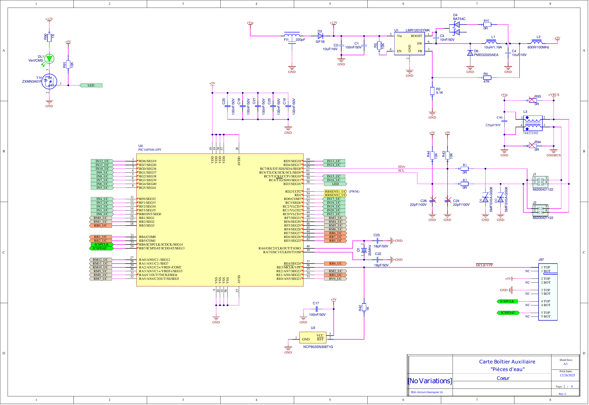
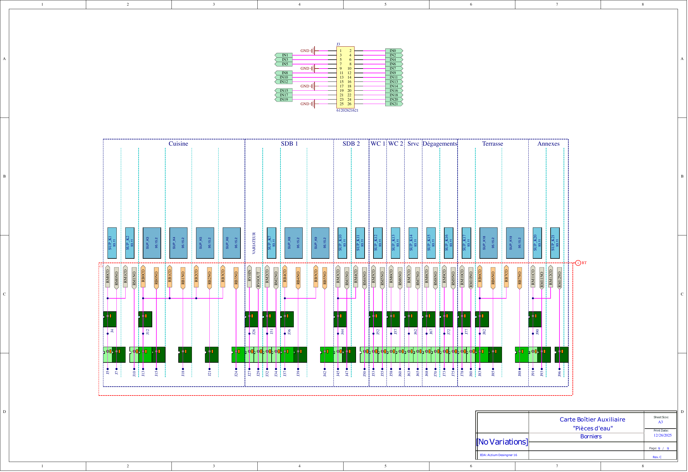

# Documentation Module SC941C

## Open Source Hardware
Bienvenue sur la documentation technique du module **SC941C** pour le projet **Essensys Atrium**. Ce projet est Open Source Hardware, conçu pour être accessible et modifiable.

## Aperçu du schéma
Voici quelques extraits du schéma électronique (MCU et Connecteurs). Pour le schéma complet, consultez la section [Schémas](schematics.md).

*Page 2 : MCU*

*Page 8 : Connecteurs*

## Sections

*   [🏛️ Architecture](architecture.md) : Détails sur l'architecture du système.
*   [🔌 Hardware](hardware.md) : Spécifications techniques et composants.
*   [📐 Schémas](schematics.md) : Vue complète page par page du schéma électronique.
*   [💻 Firmware](firmware.md) : Documentation du code source (Code BA).
*   [💾 Téléchargements](downloads.md) : Fichiers sources et de fabrication.
