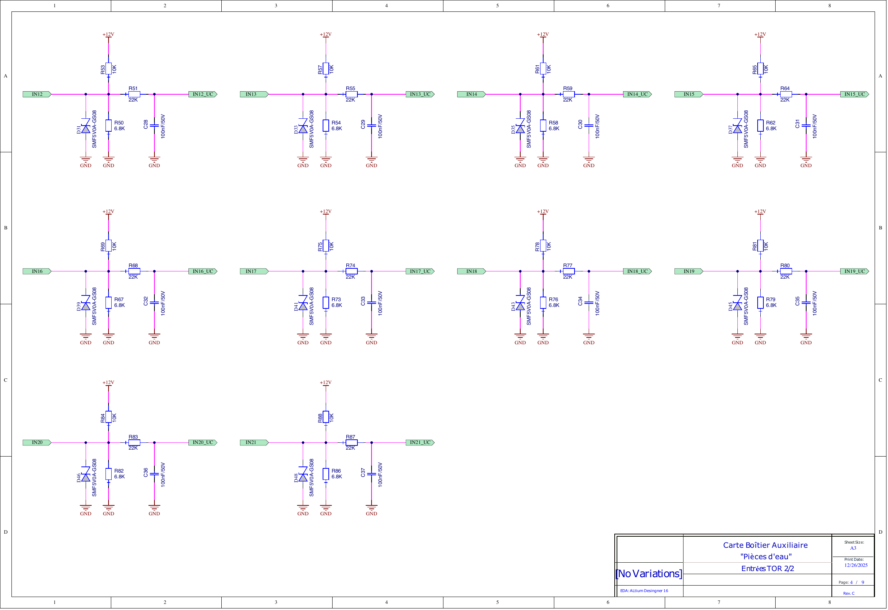
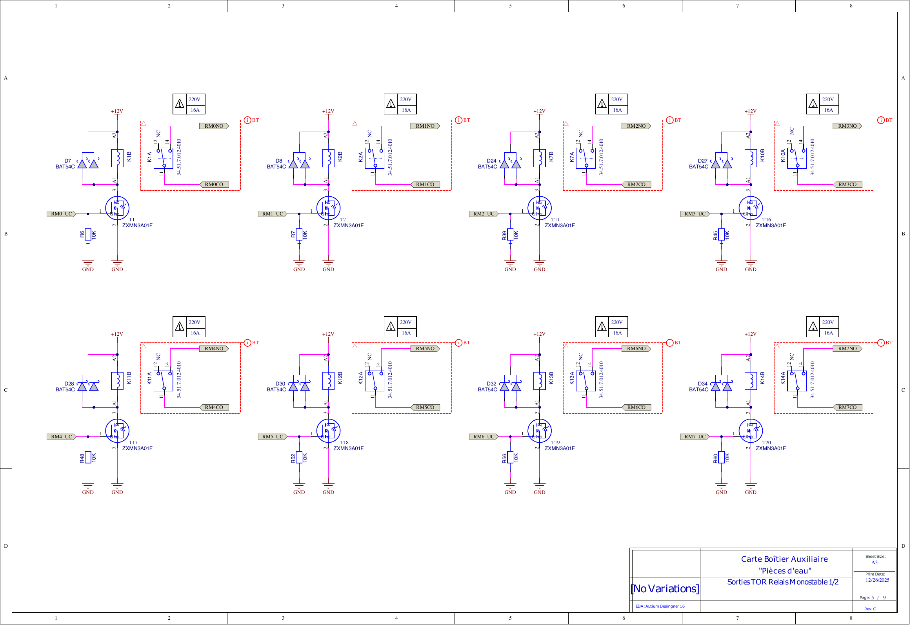
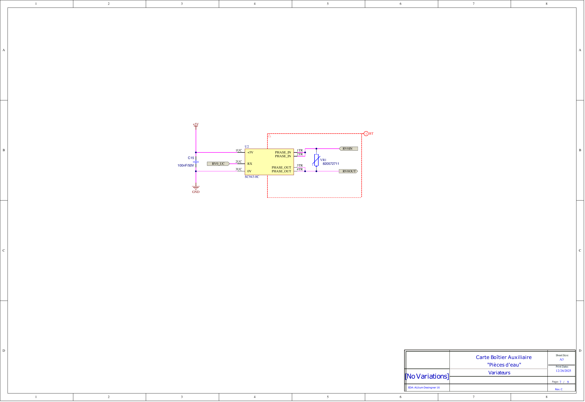

# 📐 Schéma Électronique Complet

Vous pouvez consulter ici l'intégralité du schéma électronique du module SC941C.

[📥 Télécharger le PDF complet](assets/SC941C_Schematic.pdf)

## Navigateur de Pages

### Page 1 : Sommaire / Page de Garde

### Page 2 : Microcontrôleur (MCU)

### Page 3 : Alimentation

### Page 4 : Interfaces Entrées

### Page 5 : Interfaces Sorties (Relais)

### Page 6 : Variateurs (Triacs)

### Page 7 : Bus de Communication

### Page 8 : Connecteurs

### Page 9 : Mécanique / PCB

